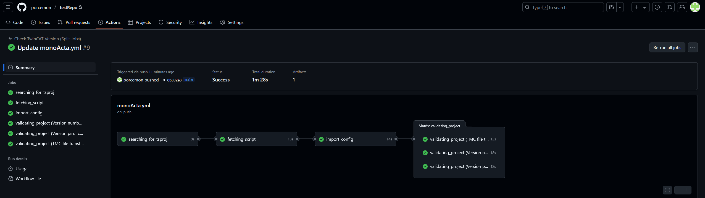
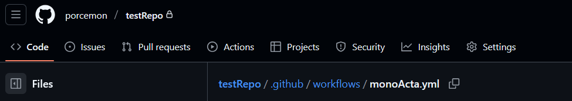
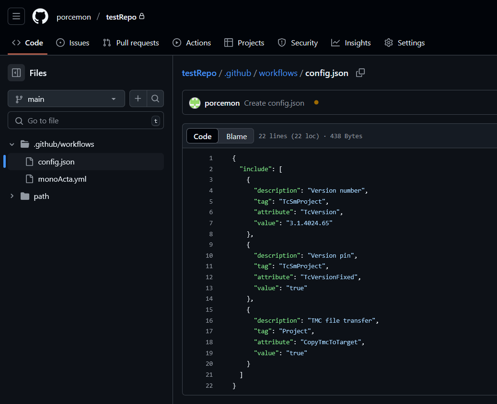

# Acta Non Verba - Actions, not words

## 🧰 Scope

Acta Non Verba is a software toolbox for verifying Beckhoff TwinCAT projects using GitHub Actions. It automates static validation checks to enforce consistency, best practices, and correct configuration.



## 📦 Requirements

This toolbox is designed for developers and engineers familiar with:

- Git & GitHub

- Shell/PowerShell scripting

- XML structure and editing

However, anyone can use it with minimal setup effort.

## Guide

### step 1:

Create a repo for your beckhoff project(s).

---

### step 2:

Copy the `workflows/` folder from `./actionSchema/` into your own repository.

To activate GitHub Actions, place it in:

```
${yourRepo}/.github/workflows/
```

> **Important:** Make sure the `monoActa.yaml` file is placed exactly at:

```
${yourRepo}/.github/workflows/monoActa.yaml
```

## 

### step 3:

Edit the `config.json` file to define the checks you want to perform on your TwinCAT `.tsproj` file.

The `.tsproj` file is an XML-like file. You can configure which tags and attributes should be verified, for example:

- Required TwinCAT version
- Whether `TcVersionFixed` is set to `true`
- If `CopyTmcToTarget` is enabled

## 

### step 4:

Run script on project.
